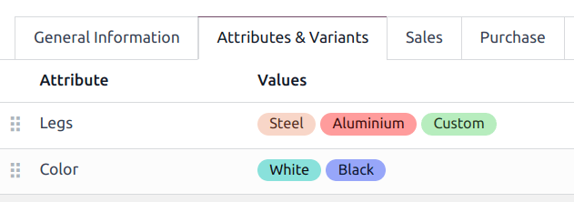
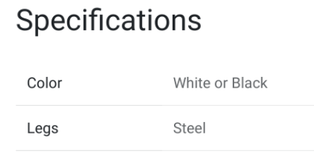

:show-content:

========
Products
========

**Odoo eCommerce** allows you to :ref:`create <products/create-products>`,
:ref:`import <products/import-products>`, and manage your :ref:`product pages
<products/product-pages>` directly within the Website app. You can also add
:ref:`product variants <products/product-variants>` and
:ref:`digital files <products/digital-files>`, enable
:ref:`product comparisons <products/product-comparison>`, :ref:`translate <products/translation>`
your product page content, and :ref:`manage your stock <products/stock-management>`.

Add products
============

.. _products/create-products:

Create products
---------------

From anywhere on your website, click :guilabel:`+ New`, then :guilabel:`Product`. Enter the
:guilabel:`Product Name`, :guilabel:`Sales Price`, and the default :guilabel:`Customer Taxes` for
local transactions, then :guilabel:`Save`. You can then update the product details, add an image,
and :ref:`customize <products/customization>` the product page. When you :guilabel:`Save` your
changes, your product page is automatically published.

.. tip::
   - You can also create a product from the backend by going to :menuselection:`Website -->
     eCommerce --> Products` and clicking :guilabel:`New`.
   - Products created from the frontend are automatically **published**, while products created from
     the backend are not. To publish a product created backend, go to your main shop page, select
     the product, and toggle the switch from :guilabel:`Unpublished` to :guilabel:`Published`.

.. _products/import-products:

Import products
---------------

You can :ref:`import products data <import-data>` using XLSX or CSV files. To do so, go to
:menuselection:`Website --> eCommerce --> Products`, click on the :icon:`fa-cog` (:guilabel:`cog`)
icon and :ref:`Import records <import-data>`.

.. _products/product-pages:

Product page
============

Once a product is created, you can access its page by going to your :guilabel:`Shop` and clicking on
the product. Click :guilabel:`Edit` to :ref:`customize <products/customization>` the page, or edit
its :ref:`layout <products/layout>` or content.

.. _products/product-form:

From your product page, you can click the :icon:`fa-cog` :guilabel:`Product` smart button in the top
right corner of the page to access the backend **product form**. You can also access the
**product form** by going to :menuselection:`Website --> eCommerce --> Products` and selecting your
product. From there, you can customize your product page by adding :ref:`products variants
<products/product-variants>` or :ref:`digital documents <products/digital-files>`, or by
:ref:`translating <products/translation>` the product page content.

.. _products/customization:

Customization
-------------

To customize a product page, go to your shop's homepage, select the product, and click
:guilabel:`Edit`. Go to the :guilabel:`Blocks` tab to add :doc:`building blocks
<../../websites/website/web_design/building_blocks>` to your product page or to the
:guilabel:`Customize` tab to modify the page layout or add features:

:guilabel:`Terms and Conditions`: toggle the switch to apply them to your product page.

:guilabel:`Customers`:

   - :guilabel:`Rating` allows customers to submit product reviews. Only logged-in portal users can
     leave ratings. You can restrict the review to internal employees only by toggling the
     :guilabel:`Public` switch next to a review comment.
   - :guilabel:`Share` adds social media and email icon buttons to share the product via those
     channels.

:guilabel:`Select Quantity`: toggle the switch to allow users to select the quantity they want for
your product.

:guilabel:`Tax indication`: toggle the switch to indicate if the price is VAT included or excluded.

:guilabel:`Variants`: show all possible :ref:`variants <products/product-variants>` of the product
as :guilabel:`Products List` or as selectable :guilabel:`Options` to compose the variant yourself.

:guilabel:`Product Tags`: toggle the switch to display the :guilabel:`Product Template Tags` on your
eCommerce, enabling product filtering by tags.

:guilabel:`Cart`:

- :guilabel:`Buy Now`: adds a checkout button taking the customer directly to the checkout page.
- :guilabel:`Wishlist`: allow signed-in users to save products in a wishlist.
- :guilabel:`Compare`: to allow shoppers to :ref:`compare products <products/product-comparison>`
  based on their attributes.

:guilabel:`Specification`: Select :guilabel:`Bottom of Page` to display the specifications at the
bottom of your product’s page. This option shows a list of all the product's variants, attributes
and values, and it only works for products with :ref:`variants <products/product-variants>`.

.. note::
   - To allow :guilabel:`Wishlists`, the :guilabel:`Product Comparison` tool, and the
     :guilabel:`Product Variants`, the options must be enabled in :menuselection:`Website -->
     Configuration --> Settings --> Shop - Products`.
   - Enabled functions apply to all product pages.

.. _products/layout:

Layout
------

The layout configuration can be changed according to your needs from the :guilabel:`Customize` tab:

- :guilabel:`Images Width`: changes the width of the product images displayed on the page.
- :guilabel:`Layout`: the :guilabel:`Carousel` layout displays a large, main image with smaller ones
  underneath; whereas the :guilabel:`Grid` displays four images in a square layout.
- :guilabel:`Image Zoom`: choose which image zooms are available, either :guilabel:`Magnifier on hover`
  :guilabel:`Pop-up on Click`, on :guilabel:`Both`, or :guilabel:`None`.
- :guilabel:`Thumbnails`: decide how the thumbnails should be aligned, either **vertically**
  (:guilabel:`Left`), or **horizontally** (:guilabel:`Right`).
- :guilabel:`Main Image`: click :guilabel:`Replace` to change the product's main image;
- :guilabel:`Extra Images`: click :guilabel:`Add` or :guilabel:`Remove all` to add or remove extra
  product images. You can also add images and videos via **URL**.

.. note::
   Images must be in PNG or JPG format and must be bigger than 1024x1024 to trigger the zoom.

.. tip::
   When dragging and dropping a building block on your product page, placing it below the blue line
   makes it visible on all product pages, while placing it above the blue line makes it visible only
   on that specific product page.

.. _products/product-variants:

Product variants
================

Product variants are different versions of the same product, such as various colors or materials,
with possibly different prices and availability.

Go to :menuselection:`Website --> Configuration --> Settings --> Shop - Products` to enable
:guilabel:`Product Variants`. The :guilabel:`Attributes & Variants` tab is now available in the
:ref:`product forms <products/product-form>`. From there, you can add attributes and values to allow
customers to configure and select product variants on the product page. For multiple attributes, you
can combine them to create specific variants.

Display type
------------

To modify the display of the attributes on your product page, select them, go to the website editor,
and to the :guilabel:`Customize` tab. In the :guilabel:`Block` section, select your preferred
:guilabel:`Display Type`: :guilabel:`Radio`, :guilabel:`Pills`, :guilabel:`Select`, or
:guilabel:`Color`.

Alternatively, the :guilabel:`Display Type` can be edited through :menuselection:`Website -->
eCommerce --> Attributes`, selecting an attribute, and then choosing a :guilabel:`Display Type`; or
through the :ref:`product form <products/product-form>`, by going to the
:guilabel:`Attributes & Variants` tab.

.. note::
   Specific combinations of values can be excluded from the product configurator, so customers are
   unable to select them. To do so, go to :menuselection:`Website --> eCommerce --> Products`,
   select a product, and go to :guilabel:`Attributes & Variants`. Then, click on an attribute,
   select a value, and in the exclude for section, select a Product Template and the
   Attribute Values to exclude.

Product specifications
----------------------

You can display your product's attributes at the bottom of the product page by going to the website
editor, :guilabel:`Customize` tab and to :guilabel:`Specification`, and selecting
:guilabel:`Bottom of Page`.

.. tip::
   Products with single values for their attributes do not generate variants but are still displayed
   in the :guilabel:`Product Specifications`.

Filter catalog by attributes
----------------------------

Customers can filter the catalog based on product attributes and values, allowing them to filter the catalog based only on the attribute(s) of their choice.
To enable attribute filtering, go to Edit ‣ Customize from your main shop page and click on one of the Categories in the left column. Here, enable either Left, Top, or both, in the Attributes field.

.. _products/digital-files:

Digital files
=============

You can add digital files like certificates, eBooks, or manual users to your product page. These
documents are available :ref:`before payment <products/before-payment>` on the product page or
:ref:`after checkout <products/after-payment>` on the customer portal.

You can add a digital file to your product page from the :ref:`product form <products/product-form>`
go to :menuselection:`Website --> eCommerce --> Products`, and select your product. Then,

#. Click the :guilabel:`Documents` smart button;
#. Click :guilabel:`NEW`;
#. Click :guilabel:`Upload your file`.

The :guilabel:`Name` field is automatically filled with the name of the uploaded file's. You  can
change it once you've uploaded the file.

.. tip::

   To edit an existing file, go to the :ref:`product form <products/product-form>`, click the
   :guilabel:`Documents` smart button, then the vertical ellipsis on the product card, and
   :guilabel:`edit`.

.. _products/before-payment:

Digital files available before payment
--------------------------------------

Make sure the :guilabel:`Sale: Visible at` field is set to :guilabel:`Hidden`, and check the
:guilabel:`Show on product` page box in the :guilabel:`E-Commerce` section. The digital file is now
available on the product page.

.. image:: digital-files.png
   :alt: digital file available before payment on the  product page

.. _products/after-payment:

Digital files available after payment
-------------------------------------

In the :guilabel:`Sales` section, go to :guilabel:`Sale: Visible at` and select :guilabel:`Confirmed
Order` from the dropdown list. The file is then available after checkout in the
:guilabel:`Sales Orders` section on the customer's portal.

.. _products/translation:

Translation
===========

If multiple languages are available on your website and you want to translate a product's
information, go to the product form to enter the translated information in the related fields.
Fields that support multiple languages are identifiable by their abbreviation language (e.g., EN)
next to their field.

.. image:: products/products-field-translation.png
   :align: center
   :alt: Field translation

The eCommerce-related fields to translate are:
#. Product name;
#. Out-of-Stock Message (under the :guilabel:`Sales` tab);
#. Sales Description (under the :guilabel:`Sales` tab).

.. note::
   Having untranslated content on a web page may be detrimental to the user experience and
   :doc:`SEO <../../websites/website/pages/seo>`.
.. note::
   To check the language(s) of your website, go to :menuselection:`Website --> Configuration -->
   Settings --> Website Info section`.

Website availability
--------------------

A product can be set available on either *one* or *all* websites, but it is not possible to select
*some* websites and not others. To define a product's availability, go to the :ref:`product form
<products/product-form>`, and in the :guilabel:`Sales` tab, click the :guilabel:`Website` you wish
the product to be available on. Leave the field empty for the products to be available on
*all* websites.

.. _products/stock-management:

Stock management
================

Go to :menuselection:`Website --> Configuration --> Settings --> Shop - Products`, to enable and
configure inventory management options.

.. important::
   - The **Inventory** app must be installed to see the inventory management options.
   - To display the stock level on your product page, the :guilabel:`Product Type` must be set to
     :guilabel:`Storable` in the :ref:`product form <products/product-form>`.

Inventory
---------

In the :guilabel:`Inventory Defaults` sub-section, select your eCommerce selling strategy:

- :guilabel:`Out-of-Stock`: Tick the :guilabel:`Continue Selling` box to allows customers to
  continue placing orders even when the product is **out-of-stock**. Leave it unchecked to
  **prevent orders**;
- :guilabel:`Show Available Qty`: Displays the available quantity left under a specified threshold
  on the product page. The available quantity is calculated based on the 'On hand' quantity minus
  the quantity already reserved for outgoing transfers.

.. _products/product-comparison:

Product comparison
==================

Your visitors can compare products based on their attributes when the :guilabel:`Product Comparison
Tool` is enabled. You can activate it by going to :menuselection:`Website --> Configuration -->
Settings --> Shop - Products` section.

On the product page, scroll down to the :guilabel:`Specifications` section and click
:guilabel:`Compare`. Repeat the same process for all products you wish to compare. Then, click the
:guilabel:`Compare` button of the pop-up window at the bottom of the page to reach the comparison
summary.

.. note::
   The :guilabel:`Product Comparison Tool` can only be used if :doc:`attributes <products/variants>`
   are set on the :ref:`product form <products/product-form>`.

.. image:: products/products-compare.png
   :align: center
   :alt: Product comparison window

.. toctree::
   :titlesonly:

   products/catalog
   products/variants
   products/price_management
   products/cross_upselling
